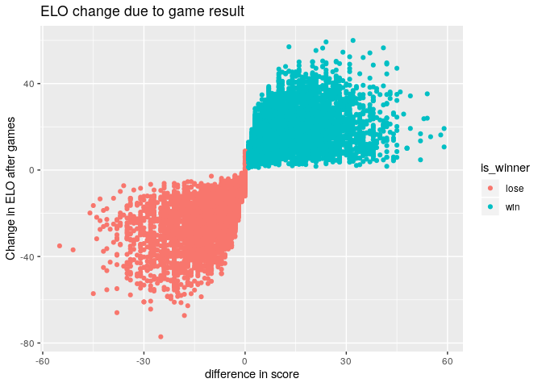

Untitled
================

## The information about columns

    ## <class 'pandas.core.frame.DataFrame'>
    ## Int64Index: 16541 entries, 0 to 16540
    ## Data columns (total 30 columns):
    ## date              16541 non-null object
    ## season            16541 non-null int64
    ## neutral           16541 non-null int64
    ## playoff           577 non-null object
    ## team1             16540 non-null object
    ## team2             16540 non-null object
    ## elo1_pre          16540 non-null float64
    ## elo2_pre          16540 non-null float64
    ## elo_prob1         16540 non-null float64
    ## elo_prob2         16540 non-null float64
    ## elo1_post         16538 non-null float64
    ## elo2_post         16538 non-null float64
    ## qbelo1_pre        14376 non-null float64
    ## qbelo2_pre        14376 non-null float64
    ## qb1               14378 non-null object
    ## qb2               14378 non-null object
    ## qb1_value_pre     14378 non-null float64
    ## qb2_value_pre     14378 non-null float64
    ## qb1_adj           14379 non-null float64
    ## qb2_adj           14379 non-null float64
    ## qbelo_prob1       14378 non-null float64
    ## qbelo_prob2       14378 non-null float64
    ## qb1_game_value    14376 non-null float64
    ## qb2_game_value    14376 non-null float64
    ## qb1_value_post    14376 non-null float64
    ## qb2_value_post    14376 non-null float64
    ## qbelo1_post       14376 non-null float64
    ## qbelo2_post       14376 non-null float64
    ## score1            16538 non-null float64
    ## score2            16538 non-null float64
    ## dtypes: float64(22), int64(2), object(6)
    ## memory usage: 3.9+ MB

## Correlation between columns

## Because of the major rule change effective in 1970, remove data points before 1970

    ## /home/franklu/anaconda3/bin/python:1: SettingWithCopyWarning: 
    ## A value is trying to be set on a copy of a slice from a DataFrame.
    ## Try using .loc[row_indexer,col_indexer] = value instead
    ## 
    ## See the caveats in the documentation: http://pandas.pydata.org/pandas-docs/stable/user_guide/indexing.html#returning-a-view-versus-a-copy

    ## /home/franklu/anaconda3/lib/python3.7/site-packages/pandas/core/indexing.py:376: SettingWithCopyWarning: 
    ## A value is trying to be set on a copy of a slice from a DataFrame.
    ## Try using .loc[row_indexer,col_indexer] = value instead
    ## 
    ## See the caveats in the documentation: http://pandas.pydata.org/pandas-docs/stable/user_guide/indexing.html#returning-a-view-versus-a-copy
    ##   self.obj[key] = _infer_fill_value(value)
    ## /home/franklu/anaconda3/lib/python3.7/site-packages/pandas/core/indexing.py:494: SettingWithCopyWarning: 
    ## A value is trying to be set on a copy of a slice from a DataFrame.
    ## Try using .loc[row_indexer,col_indexer] = value instead
    ## 
    ## See the caveats in the documentation: http://pandas.pydata.org/pandas-docs/stable/user_guide/indexing.html#returning-a-view-versus-a-copy
    ##   self.obj[item] = s

    ## /home/franklu/anaconda3/bin/python:1: FutureWarning: The signature of `Series.to_csv` was aligned to that of `DataFrame.to_csv`, and argument 'header' will change its default value from False to True: please pass an explicit value to suppress this warning.

    ##             season playoff  ...  elo_change_aftergame  elo_vs_result
    ## Unnamed: 0                  ...                                     
    ## 4549          1970     NaN  ...             12.232000   high_elo_win
    ## 4550          1970     NaN  ...            -33.748000  high_elo_lose
    ## 4551          1970     NaN  ...             38.305000    low_elo_win
    ## 4552          1970     NaN  ...             20.389000    low_elo_win
    ## 4553          1970     NaN  ...            -29.127000   low_elo_lose
    ## ...            ...     ...  ...                   ...            ...
    ## 16269         2018       d  ...             21.496606    low_elo_win
    ## 16270         2018       d  ...             13.344334   high_elo_win
    ## 16271         2018       c  ...            -18.545290  high_elo_lose
    ## 16272         2018       c  ...            -24.670271  high_elo_lose
    ## 16273         2018       s  ...            -22.445895   low_elo_lose
    ## 
    ## [11725 rows x 20 columns]

## Plot for season games

    ##             season playoff  ...  is_winner  elo_change_aftergame
    ## Unnamed: 0                  ...                                 
    ## 4549          1970     NaN  ...          1             12.232000
    ## 4550          1970     NaN  ...          0            -33.748000
    ## 4551          1970     NaN  ...          1             38.305000
    ## 4552          1970     NaN  ...          1             20.389000
    ## 4553          1970     NaN  ...          0            -29.127000
    ## ...            ...     ...  ...        ...                   ...
    ## 16269         2018       d  ...          1             21.496606
    ## 16270         2018       d  ...          1             13.344334
    ## 16271         2018       c  ...          0            -18.545290
    ## 16272         2018       c  ...          0            -24.670271
    ## 16273         2018       s  ...          0            -22.445895
    ## 
    ## [11725 rows x 19 columns]

    ## [Text(0, 0.5, 'difference in score'), Text(0.5, 0, 'difference in ELO'), Text(0.5, 1.0, 'Score vs pre-game ELO')]

    ## [Text(0, 0.5, 'difference in score'), Text(0.5, 0, 'change in elo after game'), Text(0.5, 1.0, 'Post-game ELO vs result')]

<!-- -->
