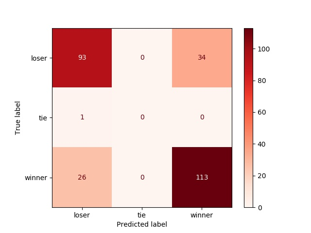
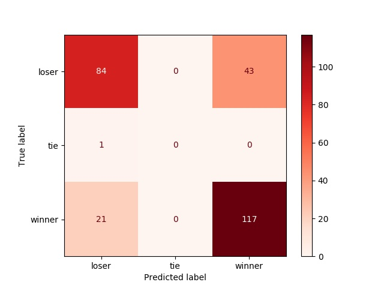

```{r setup, include=FALSE}
knitr::opts_chunk$set(echo = FALSE)
library(knitr)
library(kableExtra)
library(tidyverse)
library(caret)
library(reticulate)
library(dplyr)
```

```{r load model results}
score_rf <- read.delim("../data/rf_score.csv")
score_lr <- read.delim("../data/lr_score.csv")

```

# Summary

In this project we attempt to predict NFL game winners using classification algorithems, Random Forest and Logistic Regression, in order to test the hypothesis that ELO ratings can be used to predict the outcome as presented by the website FiveThirtyEight.com in their 'NFL Prediction Game'.

We find that both models achieve similar results, with `r score_lr[1,1]`% accuracy for the logistic regression and `r score_rf[1,1]`% accuracy for the random forest classifier. Which overall is a pretty unreliable prediction model, casting doubt over the method presented by FiveThirtyEight.


# Introduction

The sport of american football has succesfully built a reputation of an unpredictable sport where every game is important and anyone can win, coining the saying "any given Sunday" to mean that anything can happen on a football field, which are usually played on Sundays in the National Football League (NFL). Having several movies being made to this theme such as "Any Given Sunday" (1999), "Remember the Titans" (2000), or more recently the Netflix documentry "Last Chance U" (2016).

At the begining of the 2019 NFL season the website FiveThirtyEight [@fivethirtyeight] launched a [Prediction Game](https://fivethirtyeight.com/features/how-to-play-our-nfl-predictions-game/), in which the website challenges the readers to "beat the experts" who are using the ELO ranking system and prediction formulas to assign a win probability to each team for each game.

In order to test whether or not the hypothesis that NFL games can be predicted using this ELO system, as presented by FiveThirtyEight we train two machine learning classification algorithems, Random Forest and Logistic Regression to predict game winners using only pregame elo ratings for the teams and the starting quarterbacks.


# Methods

## Data
The data set used to train and test our algorithems is the same data used by FiveThirtyEight[@fivethirtyeight] in their game, which can be found [here](https://github.com/fivethirtyeight/data/tree/master/nfl-elo). Specifically the file found [here](https://projects.fivethirtyeight.com/nfl-api/nfl_elo.csv) containing historic nfl ratings and outcomes starting in 1920 was used to train the algorithems, and testing the predictions were done on the following file containing all [2019-2020](https://projects.fivethirtyeight.com/nfl-api/nfl_elo_latest.csv) NFL games and outcomes (excluding the superbowl which has yet to be played.) 

Each row in each file contains the ELO ratings pre and post game for the two NFL teams and starting Quarterbacks participating in that specific game, along with the date, season, and final score of the game. Where the home team is logged as team1 and the away team as team2.

## Choice of Models

In this project, we tried to use two basic algorithms for classification. Whenever one talk about classification, random forest is the first thing that comes to one’s mind. Random forest  can handle binary features, categorical features, and numerical features. Also, it does not require data to be scaled which reduces a lot of pre-processing.

As we know that random forest works by using multiple decision trees. All the decision trees involved in random forest operate  parallelly, which reduces the computation .  Random forest perform really well on high dimensional data because it works with subsets of data. Since, we have large amount of data to process for our training model, random forest will be most suitable in that case.

Whenever, we think of a binary classification, logistic regression comes to rescue. In this case, there are very few situations where the matches were tied, but that number was minute compared to the total number of wins and losses. So, the other model we chose was Logistic regression.

Additionally, logistic regression is one of the most simple methods. It can be implemented quickly and easily, so it was a baseline model in our case. It can be used to compare how a simple models can also perform almost similar to complex models.


## Analysis
We have used two classification models to see how the elo ratings will affect the the predicted scores.
Using Python [@Python] programming language, and the Scikit-Learn package [@scikit-learn] we trained a Logistic Regression and Random Forest classification algorithems. Since it would be redundent to predict both winner and loser for a single game, all predictions were made in relation to the home team, with 3 possible outcomes: Win, Tie, Lose.

For the data used to train the model, all seasons prior to the 1970 NFL merger were filtered out, which is the year the NFL started its shift towards the current league structure.

### Variables used:
From the original file, any variable relating to the outcome of the game was removed, such as post game elo score, each teams actual score etc'. In addition information which uniquely identifies a team outside of the ELO framework, such as team name and QB name, were removed since it could bias the results by relating information such as team performence for any given season. So, removing this identifiers for different teams was an important step to get unbiased results.

### Hyperparameters:
For the Random Forest modle, the hyperparameter “max_depth” is chosen using k-fold cross validation using k=5. The best hyperparameter was then used to train the model.

The code used to run the training and testing of the algorithems can be found at the projects github repo [here](https://github.com/UBC-MDS/Workflows_Group_306): 


# Results & Discussion

Examining the results of our model, we find that both models, the Logistic Regression and Random Forest performed very similarly at `r score_lr[1,1]`% and `r score_rf[1,1]`% accurace respectively. Indicating that although the results are better then randomly guessing, or flipping a coin, such results are hardly reliable.

In this particular case, logistic regression performs slightly better than random forest , so we can say that the prediction ability of a simple model should not be underestimated.

In the confusion matrix below we can see the "hits and misses" of the logistic regression model on the 2019-2020 season games, missing relatively more often when the home team loses with a 36.5% error rate and a 23.2% error rate for home team wins.
```{r Confusion Matrix 1, echo=FALSE, fig.cap="Figure 1. Logistic Regression Confusion Matrix.", out.width = '90%'}

```

And when looking at the random forest confusion matrix, we see an even higher error rate for home team loses at 51.2%, but a lower error rate for home team wins at 22%.
```{r Confusion Matrix 2, echo=FALSE, fig.cap="Figure 1. Logistic Regression Confusion Matrix.", out.width = '90%'}

```

Unsuprisingly both models failed to predict the tie with only one such occurrence in all of the 2019-2020 season.

With both models prediction accuracy below 80%, its would be hard to proclaim the ELO rating system as a reliable method to predict NFL game winners.

That being said it is possible that a regression method to predict the scores would do better, or alternatively including ELO ratings in a more complex and robust model could prove usefull.

# References

