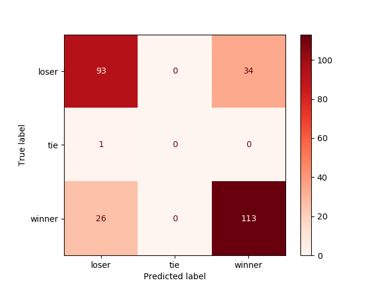
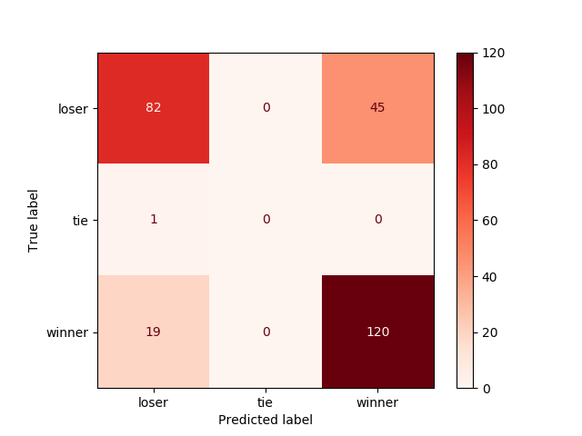

Predicting NFL game winners with ELO rating
================
Frank Lu, Simardeep Kaur, Tani Barasch  
2020/01/25 (updated: 2020-02-08)

# Summary

In this project we attempt to predict NFL game winners using
classification algorithms, Random Forest and Logistic Regression, in
order to test the hypothesis that ELO ratings can be used to predict the
outcome as presented by the website FiveThirtyEight.com in their ‘NFL
Prediction Game’.

We find that both models achieve similar results, with 0.772% accuracy
for the logistic regression and 0.753% accuracy for the random forest
classifier. Which overall is a pretty unreliable prediction model,
casting doubt over the method presented by FiveThirtyEight.

# Introduction

The sport of American Football has successfully built a reputation of an
unpredictable sport where every game is important and anyone can win,
coining the saying “any given Sunday” to mean that anything can happen
on a football field, which are usually played on Sundays in the National
Football League (NFL). Having several movies being made to this theme
such as “Any Given Sunday” (1999), “Remember the Titans” (2000), or more
recently the Netflix documentary “Last Chance U” (2016).

At the beginning of the 2019 NFL season the website FiveThirtyEight
(FiveThirtyEight 2019) launched a [Prediction
Game](https://fivethirtyeight.com/features/how-to-play-our-nfl-predictions-game/),
in which the website challenges the readers to “beat the experts” who
are using the ELO ranking system and prediction formulas to assign a win
probability to each team for each game.

In order to test whether or not the hypothesis that NFL games can be
predicted using this ELO system, as presented by FiveThirtyEight we
train two machine learning classification algorithms, Random Forest and
Logistic Regression to predict game winners using only pregame ELO
ratings for the teams and the starting quarterbacks.

## ELO Rating System

The ELO rating is a relative ranking system, in which participants gain
points by winning/performing better then expected, and have their
ranking reduced when they lose/perform worse then expected.

Since the system is relative, a change in ones ranking depends not only
on their performance, but also on who the opponent was. Performing well
against an opponent with a higher rating will result in a more
significant raise in ranking or a smaller lose if one loses, while
performing well against a lower ranked opponent will not raise ones rank
significantly but may result in a significant lose of points in case of
a poor performance.

In general the expected performance of player A is depicted with the
following equation: 
$$\[E(A) = \frac{1}{1+10^{(\frac{R_A - R_B}{400})}}\]$$
where $\(R_A\)$ is the rating of player A, and $\(E(A) + E(B) = 1\)$.

And the change in ranking is generally depicted with the following
equation: 
$$\[R^1_{A} = R^0_{A} + K(S_A - E_A)\]$$ 
Where K is a constant (set to 32 in the world of chess), $\(S_A\)$ is the actual performance of
player A and $\(E_A\)$ is the expected performance as calculated above,
and is influenced by the difference in ELO rating between the two sides.

The system was originally invented by Arpad Elo for the world of chess
(Wikipedia, n.d.). Due to its flexibility and being dependent solely on
the opponent and their rating, it has been easily adapted by various
competitive frameworks in many different fields such as online gaming
and competitive team sports, even if not officially such as the case of
rating NFL teams.

# Methods

## Data

The data set used to train and test our algorithms is the same data used
by FiveThirtyEight(FiveThirtyEight 2019) in their game, which can be
found
[here](https://github.com/fivethirtyeight/data/tree/master/nfl-elo).
Specifically the file found
[here](https://projects.fivethirtyeight.com/nfl-api/nfl_elo.csv)
containing historic NFL ratings and outcomes starting in 1920 was used
to train the algorithms, and testing the predictions were done on the
following file containing all
[2019-2020](https://projects.fivethirtyeight.com/nfl-api/nfl_elo_latest.csv)
NFL games and outcomes (excluding the Superbowl which has yet to be
played.)

Each row in each file contains the ELO ratings pre and post game for the
two NFL teams and starting Quarterbacks participating in that specific
game, along with the date, season, and final score of the game. Where
the home team is logged as team1 and the away team as team2. All these
ranking were calculated by FiveThirtyEight and used as is in order to
stay as close as possible to the original data which they claim has some
merit in predicting the outcomes.

## Choice of Models

In this project, we tried to use two basic algorithms for
classification. Whenever one talk about classification, random forest is
the first thing that comes to one’s mind. Random forest can handle
binary features, categorical features, and numerical features. Also, it
does not require data to be scaled which reduces a lot of pre-processing
and possible information loss.

As we know that random forest works by using multiple decision trees.
All the decision trees involved in random forest operate in parallel,
which reduces the computation. Random forest perform really well on high
dimensional data because it works with subsets of data. Since, we have
large amount of data to process for our training model, random forest
will be most suitable in that case.

Whenever, we think of a binary classification, logistic regression is
one of the most common algorithms used. In this case, there are very few
situations where the matches were tied, but that number was minute
compared to the total number of wins and losses. So, the other model we
chose was Logistic regression.

Additionally, logistic regression is one of the most simple methods. It
can be implemented quickly and easily, so it was a baseline model in our
case. It can be used to compare how a simple models can also perform
almost similar to complex models.

## Analysis

We have used two classification models to see how the ELO ratings will
affect the the predicted scores. Using Python (Van Rossum and Drake
2009) programming language, and the Scikit-Learn package (Pedregosa et
al. 2011) we trained a Logistic Regression and Random Forest
classification algorithms. Since it would be redundant to predict both
winner and loser for a single game, all predictions were made in
relation to the home team, with 3 possible outcomes: Win, Tie, Lose.

For the data used to train the model, all seasons prior to the 1970 NFL
merger were filtered out, which is the year the NFL started its shift
towards the current league structure.

### Variables used:

From the original file, any variable relating to the outcome of the game
was removed, such as post game ELO score, each teams actual score etc’.
In addition information which uniquely identifies a team outside of the
ELO framework, such as team name and QB name, were removed since it
could bias the results by relating information such as team performance
for any given season. So, removing this identifiers for different teams
was an important step to get unbiased results.

### Hyperparameters:

For the Random Forest model, the hyperparameter “max\_depth” is chosen
using k-fold cross validation using k=5. The best hyperparameter was
then used to train the model.

The code used to run the training and testing of the algorithms can be
found at the projects github repo
[here](https://github.com/UBC-MDS/Workflows_Group_306):

# Results & Discussion

Examining the results of our model, we find that both models, the
Logistic Regression and Random Forest performed very similarly at 0.772
and 0.753 accuracy respectively. Indicating that although the results
are better then randomly guessing, or flipping a coin, such results are
hardly reliable.

In this particular case, logistic regression performs slightly better
than random forest , so we can say that the prediction ability of a
simple model should not be underestimated.

In the confusion matrix below we can see the “hits and misses” of the
logistic regression model on the 2019-2020 season games, missing
relatively more often when the home team loses with a 36.5% error rate
and a 23.2% error rate for home team
wins.

Figure 1. Logistic Regression Confusion Matrix.

And when looking at the random forest confusion matrix, we see an even
higher error rate for home team loses at 51.2%, but a lower error rate
for home team wins at
22%.

Figure 2. Random Forest Confusion Matrix.

Unsurprisingly both models failed to predict the tie with only one such
occurrence in all of the 2019-2020 season.

With both models prediction accuracy below 80%, its would be hard to
proclaim the ELO rating system as a reliable method to predict NFL game
winners. This is also not too surprising in a sport that is notoriously
hard to predict, according the
[fantasyfootballnerd](https://www.fantasyfootballnerd.com/nfl-picks/accuracy)
website, the most accurate expert in game winning prediction, Kevin
Seifert, only had a 62% overall accuracy for 2019, which is 167 out of
256 correctly picked games.

All this indicated that at least some of the assumption made in this
work are unreliable, either the relationship between ELO ratings and
game winner is not simple and requires a more complex model, or
“squeezing” the target down from score outcome to winner and loser is
incorrect, or possibly and even likely a simple ELO ratings data set is
not suitable to actually predict such a thing, possibly because it does
not capture enough of the variance,

The first two reasons above could be tested for by using different more
complex models, and by returning to a regression prediction of score, or
difference in score. However the third possibility which would seem to
us to be likely enough to be taken seriously, would dictate that no such
model based on ELO ratings can be found, this is particularly compelling
due to the range of variables that actually affect the outcome of an NFL
game, from the possibility of a player waking of with the flu to the
quality of equipment, and PSI of the football, to more constructed
variables such as game plan and specific play calling.

And therefore it would seem like a good idea to search for a predictive
model elsewhere using a different and wider set of data to do so. \#
References

de Jonge, Edwin. 2018. *Docopt: Command-Line Interface Specification
Language*. <https://CRAN.R-project.org/package=docopt>.

FiveThirtyEight. 2019. “Fivethirtyeight Data Repository.”
fivethirtyeight. <https://data.fivethirtyeight.com/>.

Keleshev, Vladimir. 2014. *Docopt: Command-Line Interface Description
Language*. <https://github.com/docopt/docopt>.

McKinney, Wes. 2010. “Data Structures for Statistical Computing in
Python.” In *Proceedings of the 9th Python in Science Conference*,
edited by Stéfan van der Walt and Jarrod Millman, 51–56.

Pedregosa, F., G. Varoquaux, A. Gramfort, V. Michel, B. Thirion, O.
Grisel, M. Blondel, et al. 2011. “Scikit-learn: Machine Learning in
Python.” *Journal of Machine Learning Research* 12: 2825–30.

R Core Team. 2019. *R: A Language and Environment for Statistical
Computing*. Vienna, Austria: R Foundation for Statistical Computing.
<https://www.R-project.org/>.

Van Rossum, Guido, and Fred L. Drake. 2009. *Python 3 Reference Manual*.
Scotts Valley, CA: CreateSpace.

Wickham, Hadley. 2017. *Tidyverse: Easily Install and Load the
’Tidyverse’*. <https://CRAN.R-project.org/package=tidyverse>.

Wikipedia. n.d. “Wikipedia Elo Rating System.” Wikipedia.
<https://en.wikipedia.org/wiki/Elo_rating_system#Theory>.

Xie, Yihui. 2014. “Knitr: A Comprehensive Tool for Reproducible Research
in R.” In *Implementing Reproducible Computational Research*, edited by
Victoria Stodden, Friedrich Leisch, and Roger D. Peng. Chapman;
Hall/CRC. <http://www.crcpress.com/product/isbn/9781466561595>.

