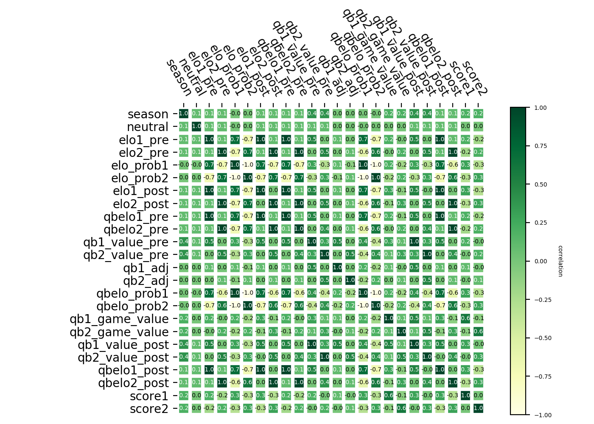

```{python import}
import numpy as np
import pandas as pd
import matplotlib.pyplot as plt
from matplotlib.pyplot import figure
from numpy.polynomial.polynomial import polyfit
import heatmap_func as hp
from numpy import genfromtxt

```

# Exploratory data analysis (EDA)
Looking at data about sports games is always exciting, and our first step is to have a better understanding of what it can tell. 

## The information about columns
We first look into the structure of the table.  It has 30 columns as below.  As our goal is to predict the result of a game, the post-game features might not be needed.
```{python read csv, echo = FALSE}
df = pd.read_csv("../data/elo_historic_raw.csv").set_index("Unnamed: 0")
df.info()
```

## Correlation between columns
As the interest is in finding a predictor for scores, we look into the correlation between different columns.



## How ELO relates to game result
Because of the major rule change effective in 1970, we removed data points before 1970 and count ELO's relationship with game results.
```{python, echo = FALSE}
df = pd.read_csv('../data/eda-elo_vs_result.csv', names = ['type', 'count'])
high_elo_win_cnt = df.query("type == 'high_elo_win'")['count'].values[0]
total = sum(df['count'])
rate = high_elo_win_cnt/total
print(df.head())
print(f"The number of total games is {total}.  Among them, higher ELO before the game results in {high_elo_win_cnt} wins.")
print(f"This translates to about {rate:.3f} of winning rate")
```

## Plot for season games
Below is the plot for comapring game results to ELO.


We also found that winning or losing a game does affect ELO.
