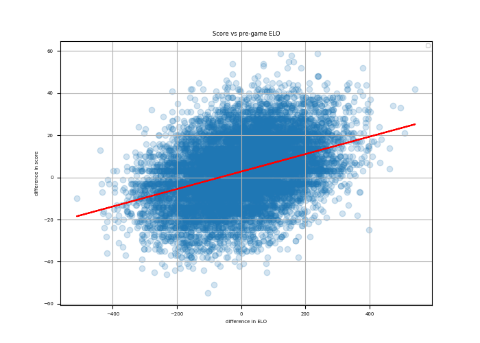

Milestone 2 Report - EDA Portion
================

``` python
import numpy as np
import pandas as pd
import matplotlib.pyplot as plt
from matplotlib.pyplot import figure
from numpy.polynomial.polynomial import polyfit
import heatmap_func as hp
from numpy import genfromtxt
```

# Exploratory data analysis (EDA)

Looking at data about sports games is always exciting, and our first
step is to have a better understanding of what it can tell.

## The information about columns

We first look into the structure of the table. It has 30 columns as
below. As our goal is to predict the result of a game, the post-game
features might not be needed.

    ## <class 'pandas.core.frame.DataFrame'>
    ## Int64Index: 16541 entries, 0 to 16540
    ## Data columns (total 30 columns):
    ## date              16541 non-null object
    ## season            16541 non-null int64
    ## neutral           16541 non-null int64
    ## playoff           577 non-null object
    ## team1             16541 non-null object
    ## team2             16541 non-null object
    ## elo1_pre          16541 non-null float64
    ## elo2_pre          16541 non-null float64
    ## elo_prob1         16541 non-null float64
    ## elo_prob2         16541 non-null float64
    ## elo1_post         16540 non-null float64
    ## elo2_post         16540 non-null float64
    ## qbelo1_pre        14378 non-null float64
    ## qbelo2_pre        14378 non-null float64
    ## qb1               14379 non-null object
    ## qb2               14379 non-null object
    ## qb1_value_pre     14379 non-null float64
    ## qb2_value_pre     14379 non-null float64
    ## qb1_adj           14379 non-null float64
    ## qb2_adj           14379 non-null float64
    ## qbelo_prob1       14379 non-null float64
    ## qbelo_prob2       14379 non-null float64
    ## qb1_game_value    14378 non-null float64
    ## qb2_game_value    14378 non-null float64
    ## qb1_value_post    14378 non-null float64
    ## qb2_value_post    14378 non-null float64
    ## qbelo1_post       14378 non-null float64
    ## qbelo2_post       14378 non-null float64
    ## score1            16540 non-null float64
    ## score2            16540 non-null float64
    ## dtypes: float64(22), int64(2), object(6)
    ## memory usage: 3.9+ MB

## Correlation between columns

As the interest is in finding a predictor for scores, we look into the
correlation between different columns.


## How ELO relates to game result

Because of the major rule change effective in 1970, we removed data
points before 1970 and count ELO’s relationship with game results.

    ##             type  count
    ## 0  high_elo_lose   1686
    ## 1   high_elo_tie     28
    ## 2   high_elo_win   4193
    ## 3   low_elo_lose   3200
    ## 4    low_elo_tie     25

    ## The number of total games is 11725.  Among them, higher ELO before the game results in 4193 wins.

    ## This translates to about 0.358 of winning rate

## Plot for season games

Below is the plot for comapring game results to ELO.


We also found that winning or losing a game does affect ELO.

